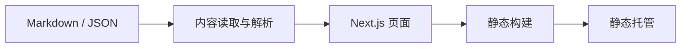

<div align="center">

# alanbulan Blog

用 Markdown 和结构化内容维护的个人站点与作品展示。


[本地开发](#本地开发) · [内容维护](./CMS_GUIDE.md) · [静态部署](./DEPLOYMENT.md) · [页面核对](./CHECK_URL.md)

</div>

基于 Next.js App Router、React、TypeScript 和 Tailwind CSS 的个人网站。文章、项目与技能数据放在 `content/`，由 `lib/content.ts` 在构建时读取。当前配置采用静态导出，不需要在静态托管端运行 Node.js 服务。

## 本地开发

准备满足 [package.json](./package.json) 依赖要求的 Node.js/npm。仓库保存的是历史依赖组合；用于公网前应单独审查和升级，不把当前版本号当作推荐版本。

```sh
git clone https://github.com/alanbulan/blog.git
cd blog
npm install
npm run dev
```

打开终端给出的地址，通常为 `http://localhost:3000`。

| 命令 | 用途 |
| --- | --- |
| `npm run dev` | 本地开发服务器 |
| `npm run build` | 根据 `output: 'export'` 生成静态站点 |
| `npm run lint` | 当前仓库的 lint 入口；需结合实际环境核验 |

`package.json` 虽然保留了 `npm run start`，但当前静态导出配置不按 `next start` 部署。预览和发布方式见[部署说明](./DEPLOYMENT.md)。

## 内容与结构

| 位置 | 职责 |
| --- | --- |
| [app](./app) | 首页、关于、文章列表、联系、作品与技能页面 |
| [components](./components) | 页头、页脚等共享界面 |
| [content/blog](./content/blog) | 带 Front Matter 的文章 Markdown |
| [content/projects](./content/projects) | 作品数据与链接 |
| [content/settings](./content/settings) | 站点资料与页面配置 |
| [lib/content.ts](./lib/content.ts) | 内容解析、过滤与排序 |
| [next.config.js](./next.config.js) | 静态导出、图片与尾斜杠设置 |



## 使用边界

页面布局、按钮和表单存在，不代表已接入提交服务、筛选逻辑或文章详情页。请按[页面核对清单](./CHECK_URL.md)逐项验证。文章正文被解析也不等于已有正文路由；新增能力需要补齐页面实现。

站点中的个人资料、作品描述、日期和统计字段属于内容文件，不保证自动同步 GitHub。发布前核对准确性，不将示例内容或手写 Star 数当成实时履历。

本站源码、内容与第三方依赖的授权应分别核对；文档补齐不新增或变更现有许可证。问题反馈请附页面路径、复现步骤、浏览器版本和脱敏日志。
